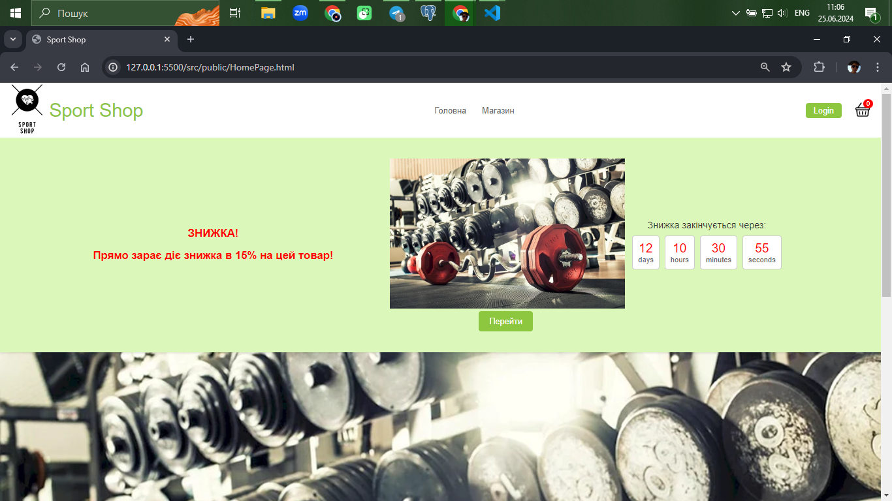
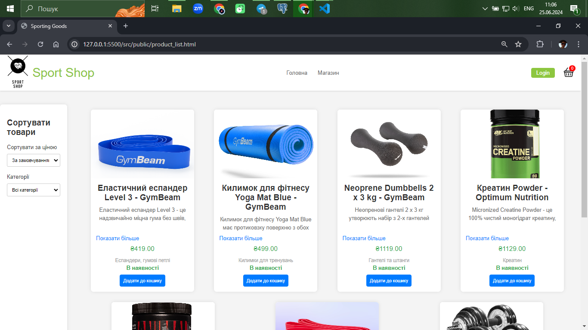
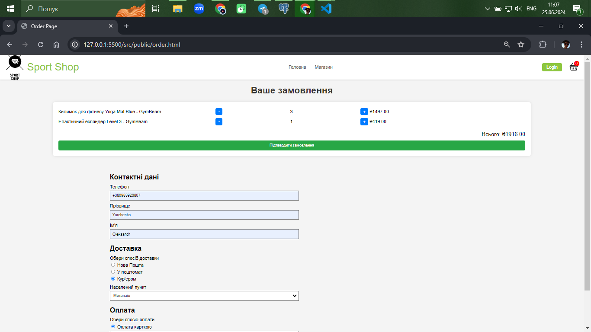
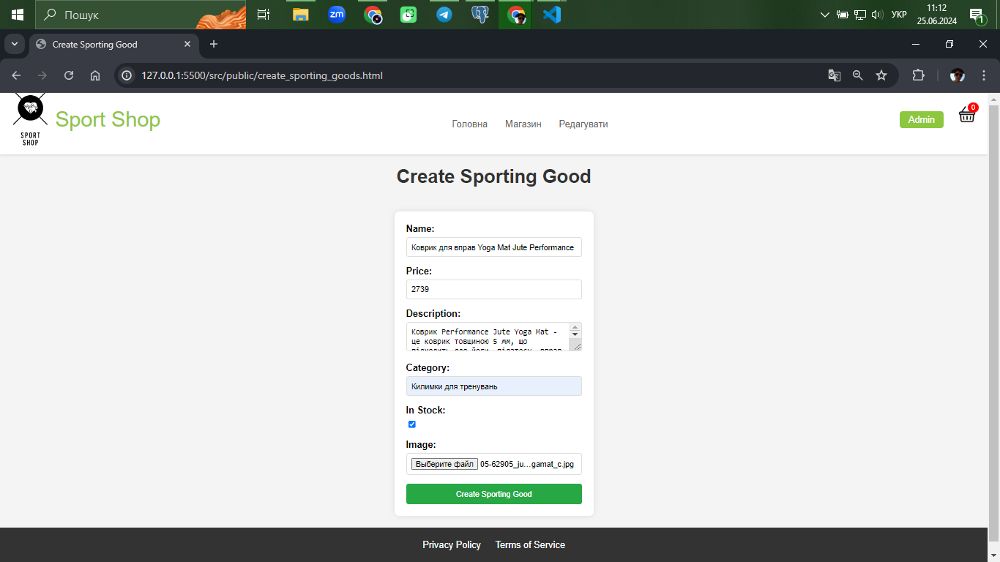
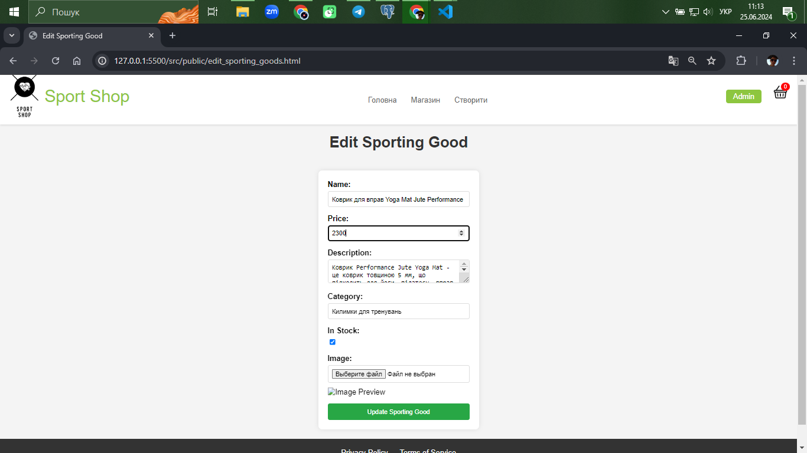
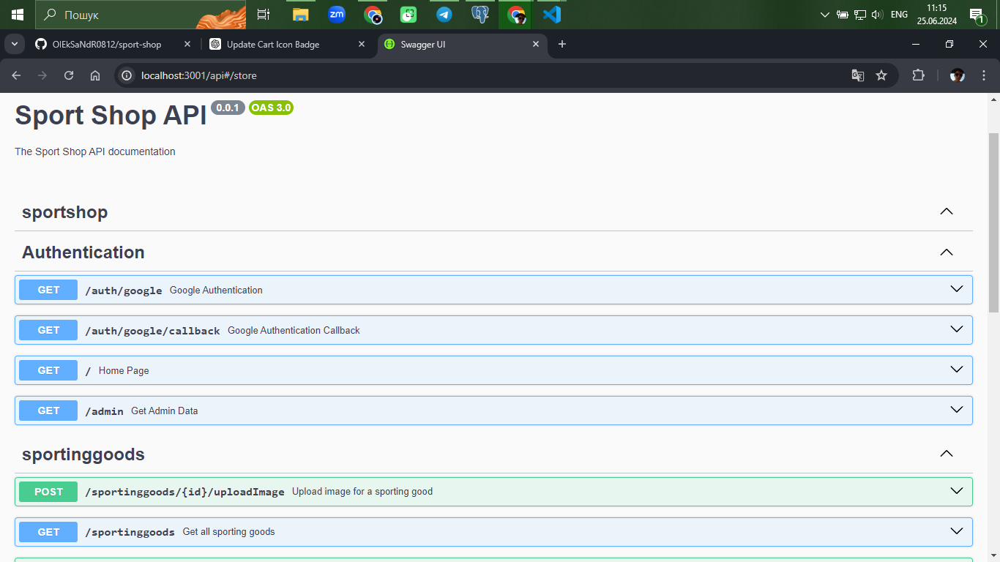
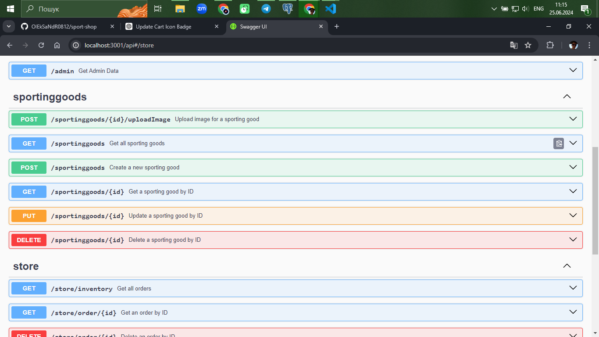
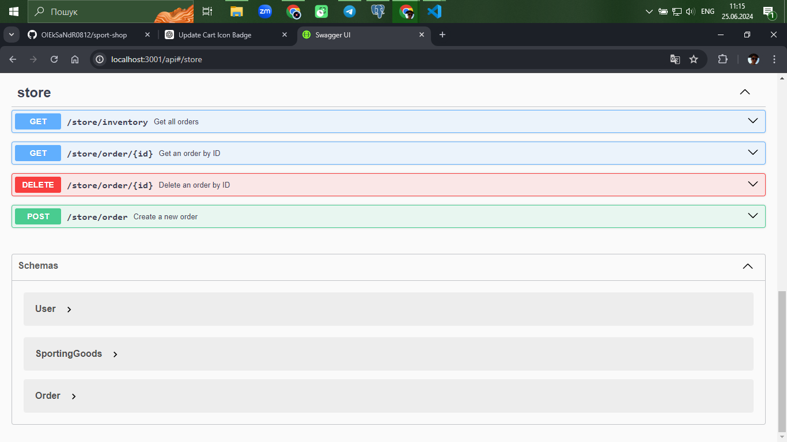

**Sport Shop**
The Sport Shop Web Application is a dynamic web application developed as a student project, showcasing the capabilities of modern web development technologies. Leveraging the powerful NestJS framework for its backend, the app ensures a fast and seamless user experience. The robust and scalable PostgreSQL database is utilized for efficient data management, allowing for smooth handling of user, product, and order data. The user interface is elegantly styled using Bootstrap, providing a visually appealing and highly customizable design.
<p align="center">
  <a href="http://nestjs.com/" target="blank"></a>
</p>

[circleci-image]: https://img.shields.io/circleci/build/github/nestjs/nest/master?token=abc123def456
[circleci-url]: https://circleci.com/gh/nestjs/nest

  <p align="center">A progressive <a href="http://nodejs.org" target="_blank">Node.js</a> framework for building efficient and scalable server-side applications.</p>
    <p align="center">
<a href="https://www.npmjs.com/~nestjscore" target="_blank"></a>
<a href="https://www.npmjs.com/~nestjscore" target="_blank"></a>
<a href="https://www.npmjs.com/~nestjscore" target="_blank"></a>
<a href="https://circleci.com/gh/nestjs/nest" target="_blank"></a>
<a href="https://coveralls.io/github/nestjs/nest?branch=master" target="_blank"></a>
<a href="https://discord.gg/G7Qnnhy" target="_blank"></a>
<a href="https://opencollective.com/nest#backer" target="_blank"></a>
<a href="https://opencollective.com/nest#sponsor" target="_blank"></a>
  <a href="https://paypal.me/kamilmysliwiec" target="_blank"></a>
    <a href="https://opencollective.com/nest#sponsor"  target="_blank"></a>
  <a href="https://twitter.com/nestframework" target="_blank"></a>
</p>
  <!--[](https://opencollective.com/nest#backer)
  [](https://opencollective.com/nest#sponsor)-->

## Description

[Nest](https://github.com/nestjs/nest) framework TypeScript starter repository.
## Learn More
To learn more about NestJS, take a look at the following resources:

NestJS Documentation - learn about NestJS features and API.
Learn NestJS - a guide for getting started with NestJS.
You can check out the NestJS GitHub repository - your feedback and contributions are welcome!

## Installation

```bash
$ npm install
```

## Running the app

```bash
# development
$ npm run start

# watch mode
$ npm run start:dev

# production mode
$ npm run start:prod
```
Open [http://localhost:3001](http://localhost:3001) with your browser to see the result.
You can start editing the page by modifying `public/HomePage.js`. The page auto-updates as you edit the file.

## Using the app

The application has **two options for use**:

-Administrative page

-User-client

Home page

Shop page

Order page


To use the administrative page, you must have the "admin" status, which is **assigned in the config.ts file, where the admin's email address is specified** or you can manually change the user status in PostgreSQL.
With the status **"admin"** the user can add sports goods and edit them:



## Swagger UI

To view the Swagger UI, an extension was installed **in Visual Studio Code - Swagger Previewer**.

 A **swagger.json** file was also created, which describes all the components, object models used to manage data in various application **endpoints**.



